## 基础选择器
- 类选择器, 标签选择器, ID 选择器, 复合选择器

- 多类选择器


<style>
	.p1 {
		color: red;
	}
	.p2 {
		font-size: 30px;
	}
	#p3 {
		background-color: green
	}
</style>

<div>
	<span class="p1 p2" id="p3">
		123
	</span>
</div>


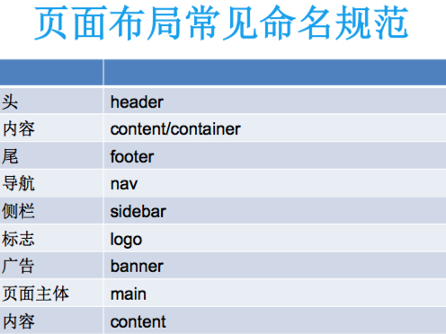
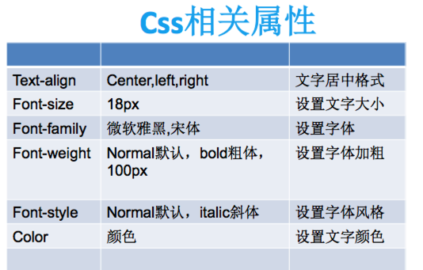
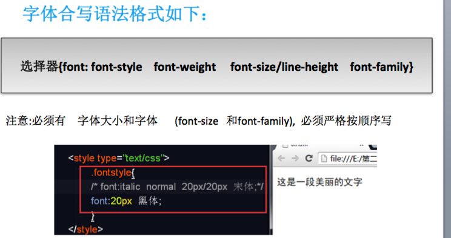

### 复合选择器
- 交集选择器

```
div.class {
}

div#id {
}
```

- 后代选择器

```
div h3 {

}
```


- 并集选择器

```
div, h3 {

}
```

```
	<style type="text/css">
		div.div1 ul.box li,div.div1 p{
			color:red;
		}
		div.box p.p1,div.box div.div1 p,p {
			color: green;
		}
	</style>
	
	<body>
	<div class="div1">
		<ul class="box">
			<li>14期威武</li>
		</ul>
	</div>

	<div class="div1">
		<p>14期霸气</p>
	</div>
	
	<div class="box">
		<p class="p1"></p>
	</div>
	<div class="box">
		<div class="div1">
			<p></p>
		</div>
	</div>
	<p></p>
</body>
```

## 标签元素

- 块元素block

```
<div>、 <p>、<h1>、<form>、<ul> 和 <li>
```

- 行内元素 inline

```
<a>、<span>、<br>、<i>、<em>、<strong>、<label>
```

- 行内块 inlin3-block

```
、<input>
```


### 继承


### CSS 伪类

 
- :link
	- 伪类将应用于未被访问过的链接。IE6不兼容，解决此问题，直接使用a标签。


- :visited
	- 伪类将应用于已经被访问过的链接

- :hover
	- 伪类将应用于有鼠标指针悬停于其上的元素。在IE6只能应用于a连接，IE7+所有元素都兼容。

- :active
	- 伪类将应用于被激活的元素，如被点击的链接、被按下的按钮等。

- :focus
	- 伪类将应用于拥有键盘输入焦点的元素。

- love hate; lv ht

<style>
/*链接默认状态*/
.love-hate:link {
	color: red;
	text-decoration: none;
}
/*链接访问之后的状态*/
.love-hate:visited {
	color: green;
}
/*鼠标放到链接上显示的状态*/
.love-hate:hover {
	color: blue;
	text-decoration: line-through;
}
/*链接激活的状态*/
.love-hate:active{
	color: yellow;
}

</style>

<div>
	<a class="love-hate" href="#">LOVE HATE</a>
</div>

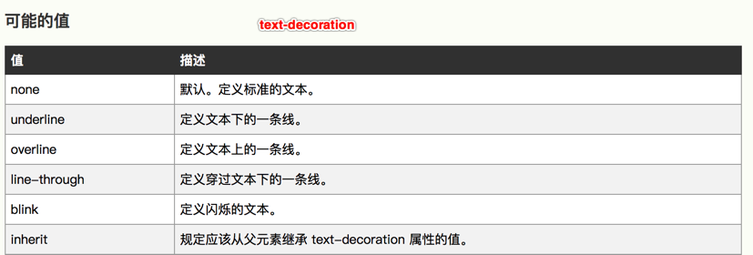


## 背景 background

```
background-color:设置背景颜色
background-image:设置背景图片
background-repeat:  设置背景平铺    one-repeat   repeat-x   repeat-y
background-postion:  设置背景位置   left,right,center,top,bottom
background-attachment:   设置背景是否固定    
背景连写 ：没有先后顺序，都是可选的
text-indent: 缩进
```

<style>
li{ 
		/*清除列表项符号*/
		list-style: none;
		background: url("./images/li.gif") no-repeat left center;
		text-indent:20px;
	}
</style>

<div>
		<li><a href="#">大明星:姜潮魔性拜年道晚安</a></li>
		<li><a href="#">大明星:姜潮魔性拜年道晚安</a></li>
</div>


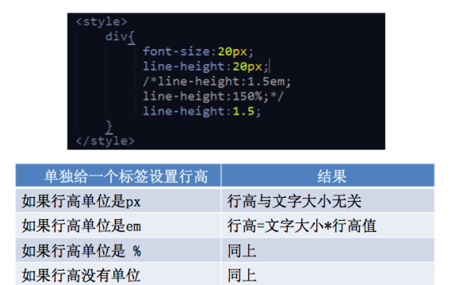
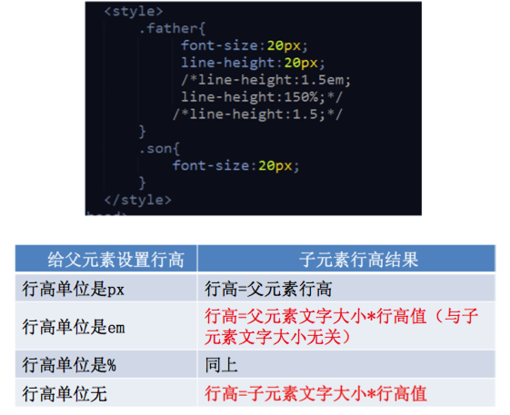


## 盒子模型

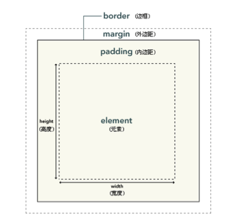

<style>
.table-border-demo {
	width: 200px;
	height: 100px;
	border: 2px solid red;
	// 为表格设置合并边框模型：
	border-collapse: collapse;
}
.table-border-demo td {
	border: 2px solid red;
}
</style>

<div>
	<table cellspacing="0" class="table-border-demo">
		<tr>
			<td></td>
			<td></td>
			<td></td>
		</tr>
		<tr>
			<td></td>
			<td></td>
			<td></td>
		</tr>
	</table>
</div>

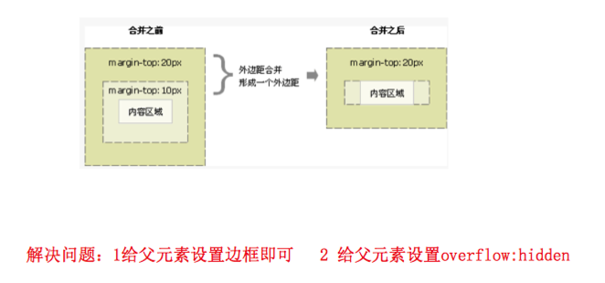

<div style="height: 100px; width: 200px; background-color: red">
<div style="height: 50px; width: 100px; background-color: green; overflow: hidden">
	<div style="height: 25px; width: 50px; background-color: yellow; margin-top: 20px">

</div>
</div>
</div>


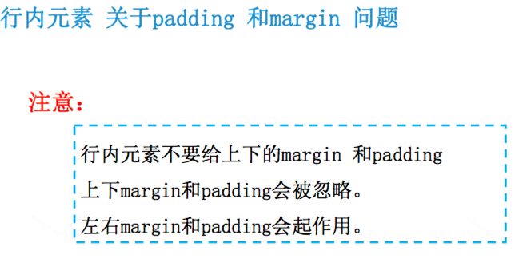

<style>
	.container {
	border: 2px #333333 solid;
	width: 300px;
	border-top-color: red;
	margin: 0 auto;
	}
	.news-title {
		height: 35px;
	 	border-bottom: 1px solid #D9E0EE;
	 	line-height: 35px;
	 	padding-left: 12px;
	}
	.news-title ul {
		margin-top: 14px;
	}
</style>

<div>
	<div class="container">
	<div class="news-title">行业动态</div>
		<ul>
			<li>气质不错气质不错</li>
			<li>气质不错气质不错</li>
			<li>气质不错气质不错</li>
			<li>气质不错气质不错</li>
		</ul>
	</div>
</div>

### 浮动

<style type="text/css">
	.box-float{
		width: 400px;
		height: 300px;
		background: #eee;
	}
	.box-float img{
		float: left;
	}
</style>

<div class="box-float">
	
	<p>“中国优势”知多少 听习近平为你一一道来</p>
	<p>“中国优势”知多少 听习近平为你一一道来</p>
	<p>“中国优势”知多少 听习近平为你一一道来</p>
</div>


#### 浮动脱离文档流 不会撑大父级高度

<style type="text/css">
		body,ul,li{
			margin:0;
			padding: 0;
		}
		ul,li{
			list-style: none;
		}
		.nav{
			width: 800px;
			background: pink;
			margin: 20px auto;
			height: 40px;
			background-color: red;
		}
		.nav ul li{
			background-color: pink;
			float: left;
			background-image: url('');
		}
		.nav ul li a{
			display: inline-block;
			height: 40px;
			font: 14px/40px 微软雅黑;
			padding:0 20px;
			text-decoration: none;
		}
		.nav ul li a:hover{
			background: #aaa;
		}

</style>


<div class="nav">
	<ul>
		<li><a href="#">百度</a></li>
		<li><a href="#">百度一下</a></li>
		<li><a href="#">14期威武</a></li>
	</ul>
</div>


### 清除浮动

- 1, content.height = sidebar.height
- 2, header footer .style: clear: left/both/right 清除
	- 左侧和右侧均不允许出现浮动元素：
- 3, main.overflow.hidden = true 
- 4, main.class 增加 clearfix 类

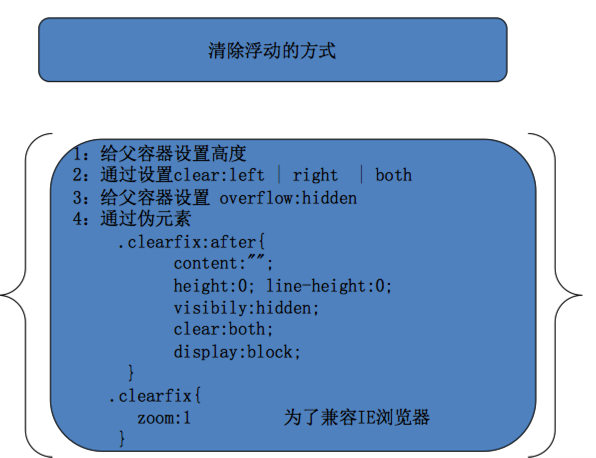
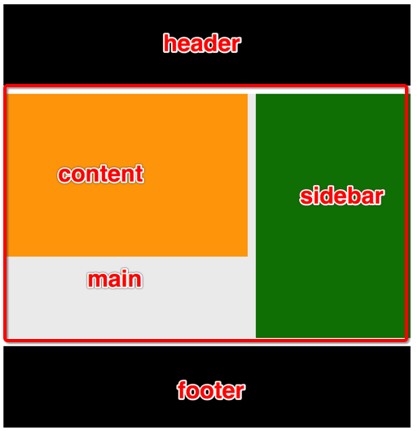

### 定位


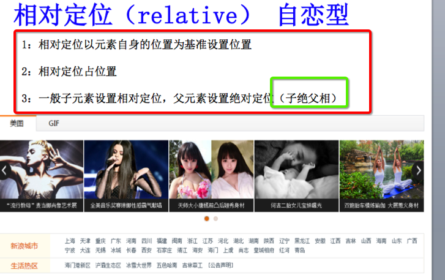
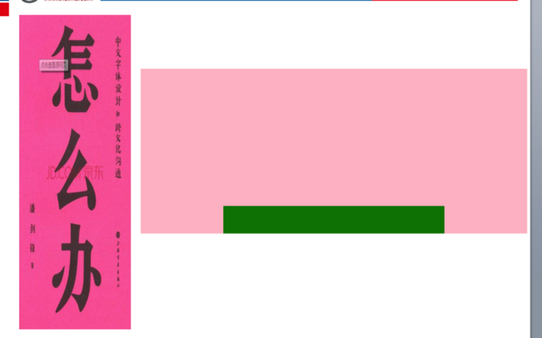


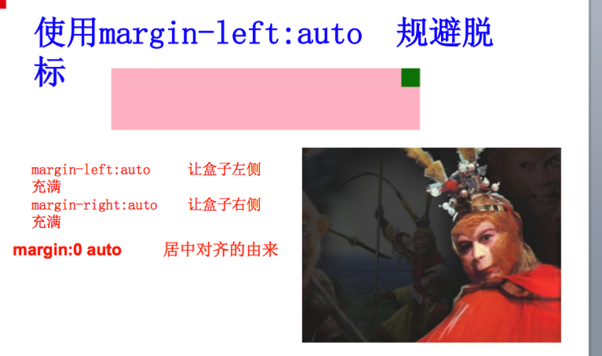
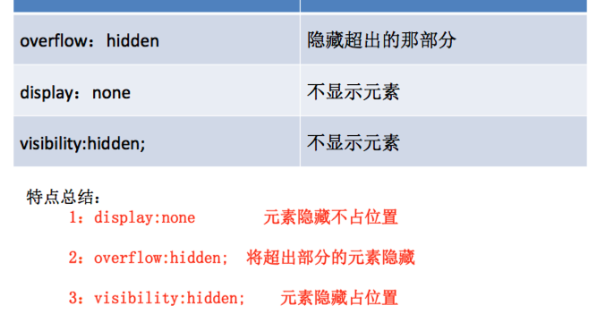

### tab 切换

<style type="text/css">
	.boxn01,.div01,.div02,.div03{
		width: 300px;
		height: 300px;
	}
	.boxn01{
		overflow: hidden;
	}
	.div01{
		background: red;
	}
	.div02{
		background: green;
	}
	.div03{
		background: pink;
	}
</style>
	
<div>
	<a href="#div01">div1</a>
	<a href="#div02">div2</a>
	<a href="#div03">div3</a>
	<div class="boxn01">
		<div class="div01" id="div01"></div>
		<div class="div02" id="div02"></div>
		<div class="div03" id="div03"></div>
	</div>
</div>


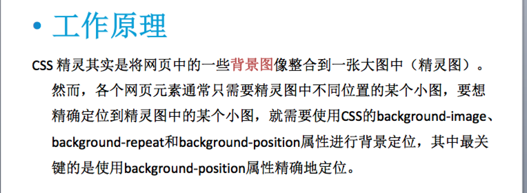

### 滑动门(background-repeat:repeat-x)

<style>
      .one{
      	 width:10px;
      	 height:100px;
      	 background-image:url(./images/l.png);
      	 float:left;
          line-height: 100px;
      }
     .two{
         height:100px;
         background-image:url(./images/m.png);
         background-repeat:repeat-x;
         float:left;
         line-height: 100px;
      }

      .tree{
      	 width:10px;
      	 height:100px;
      	 background-image:url(./images/r.png);
      	 float:left;
        line-height: 100px;
      }
      
</style>

<div style="height: 100px">
      <div class="one"></div>
      <div class="two">asdfaasdfasdfasdfs</div>
      <div class="tree"></div>
</div>


### 属性选择器

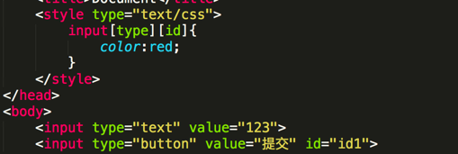


